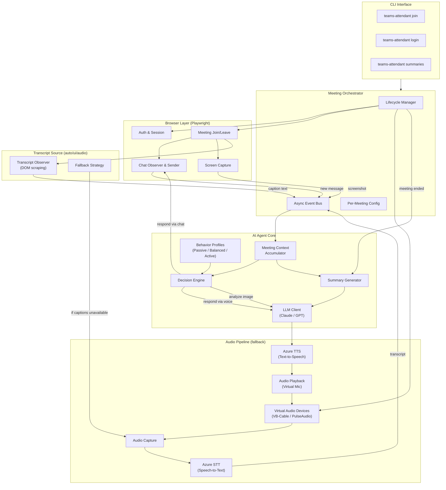

# Teams Attendant

An AI agent that attends Microsoft Teams meetings on your behalf. It joins under your identity — indistinguishable from you — observes everything happening in the meeting, participates via chat and voice, and delivers a summary when it's done.

## Features

- **Attend as you** — Uses browser automation to join meetings under your real Teams identity. Other participants see *you*, not a bot.
- **Listen & understand** — Reads meeting transcripts from Teams live captions (preferred) or captures audio and transcribes via Azure Speech Services. Automatic fallback when captions aren't available.
- **Read the room** — Monitors the meeting chat for messages, questions, and mentions.
- **Speak up** — Responds via voice (text-to-speech routed through a virtual microphone) or chat, depending on context.
- **See what's shared** — Optionally captures screen-shared content and analyzes it with vision capabilities (Claude and GPT both supported).
- **Tunable behavior** — Three built-in profiles (Passive, Balanced, Active) control how much the agent participates. Configurable per meeting.
- **Meeting summaries** — Generates a structured post-meeting summary including discussion points, decisions, action items, and how the agent contributed.

## Architecture



### Data Flow

```
Teams Captions ─→ DOM Scraping ─→ TranscriptObserver ────────────────────→ Transcript
        (or)                                                                   │
Meeting Audio ──→ Virtual Speaker ─→ Audio Capture ─→ Azure STT ──(fallback)──→│
                                                                               │
Chat Messages ─────────────────────────────────────────────────────────────────→│
                                                                               │
Screen Shares ─→ Screenshot ─→ LLM Vision (Claude / GPT) ─────────────────────→│
                                                                               ▼
                                                                         Meeting Context
                                                                               │
                                                                    ┌──────────┴──────────┐
                                                                    ▼                     ▼
                                                            Decision Engine        Summary Generator
                                                             (+ Profiles)               │
                                                                    │                    ▼
                                                           ┌────────┴────────┐    Markdown Report
                                                           ▼                ▼
                                                     Voice Reply      Chat Reply
                                                           │                │
                                                    LLM → TTS      Browser Chat
                                                           │
                                                    Virtual Mic → Meeting
```

## Behavior Profiles

The agent's participation level is controlled by behavior profiles, configured per meeting:

| Profile | When it speaks | Response style | Best for |
|---|---|---|---|
| **Passive** | Only when directly addressed by name | Minimal, concise | Meetings you need notes from but shouldn't "attend" actively |
| **Balanced** | When addressed, or when it can add clear value | Moderate, helpful | Regular team meetings, standups |
| **Active** | Proactively contributes, asks questions, engages | Full participation | Brainstorms, working sessions, workshops |

Each profile is a YAML file under `config/profiles/` and controls: response threshold, proactivity level, response length, topics of interest, and voice vs. chat preference.

## Project Structure

```
teams-attendant/
├── pyproject.toml                  # Project metadata & dependencies
├── README.md
├── config/
│   ├── default.yaml                # Default agent configuration
│   └── profiles/                   # Behavior profiles
│       ├── passive.yaml
│       ├── balanced.yaml
│       └── active.yaml
├── src/
│   └── teams_attendant/
│       ├── __init__.py
│       ├── cli.py                  # CLI entry point (Typer)
│       ├── config.py               # Configuration models (Pydantic)
│       ├── orchestrator.py         # Meeting lifecycle orchestrator
│       ├── browser/
│       │   ├── auth.py             # Teams login & session management
│       │   ├── meeting.py          # Join/leave meetings
│       │   ├── chat.py             # Chat observation & interaction
│       │   └── screen.py           # Screen capture for vision mode
│       ├── audio/
│       │   ├── capture.py          # Meeting audio capture
│       │   ├── playback.py         # TTS audio → virtual mic
│       │   ├── stt.py              # Azure Speech-to-Text
│       │   ├── tts.py              # Azure Text-to-Speech
│       │   └── devices.py          # Virtual audio device management
│       ├── agent/
│       │   ├── core.py             # Decision engine
│       │   ├── context.py          # Meeting context accumulator
│       │   ├── llm.py              # LLM client (Claude via Azure Foundry / OpenAI GPT)
│       │   ├── profiles.py         # Behavior profile definitions
│       │   └── summarizer.py       # Post-meeting summary generation
│       └── utils/
│           ├── events.py           # Async event bus
│           └── logging.py          # Structured logging
├── summaries/                      # Generated meeting summaries
└── tests/
```

## Prerequisites

- **Python 3.12+**
- **Azure Speech Services** subscription — needed only when using audio transcription mode (`transcript_source: "audio"` or as fallback in `"auto"` mode). Not required for `"ui"` mode.
- **Azure Foundry** access — with an Anthropic Claude model deployed (when `llm_provider: "anthropic"`, the default)
- **OpenAI API key** — for GPT models (when `llm_provider: "openai"`)

> **Note:** Only one LLM provider is needed — choose either Azure Foundry (Claude) or OpenAI (GPT).
- **Virtual audio driver** *(audio mode only)* — not needed when using Teams live captions:
  - **Windows:** [VB-Audio Virtual Cable](https://vb-audio.com/Cable/) (free)
  - **Linux:** PulseAudio (usually pre-installed)

## Installation

```bash
# Clone the repository
git clone https://github.com/your-username/teams-attendant.git
cd teams-attendant

# Create a virtual environment
python -m venv .venv
source .venv/bin/activate        # Linux/macOS
# .venv\Scripts\activate         # Windows

# Install the package
pip install -e ".[dev]"

# Install Playwright browsers
playwright install chromium
# Optional: to use Edge, ensure it's installed and set browser: "msedge" in config
```

### Virtual Audio Setup

<details>
<summary><b>Windows (VB-Audio Virtual Cable)</b></summary>

1. Download and install [VB-Audio Virtual Cable](https://vb-audio.com/Cable/)
2. After installation, you should see **CABLE Input** and **CABLE Output** in your audio devices
3. The agent will auto-detect VB-Cable devices on startup
4. Run `teams-attendant audio check` to verify the setup

</details>

<details>
<summary><b>Linux (PulseAudio)</b></summary>

The agent automatically creates and manages PulseAudio virtual devices. Ensure PulseAudio is running:

```bash
pulseaudio --check || pulseaudio --start
```

</details>

## Configuration

### First-Time Login

Authenticate with Microsoft Teams (only needed once — the session is persisted):

```bash
teams-attendant login
```

This opens a browser window (Chromium by default, or Edge if configured) where you sign into Teams normally. After successful login, the session cookies are saved for future use.

### Azure Credentials

Create a `config/default.yaml` or set environment variables:

```yaml
azure:
  speech:
    key: "your-azure-speech-key"
    region: "eastus"
  foundry:
    endpoint: "https://your-foundry.azure.com"
    api_key: "your-foundry-api-key"
    model_deployment: "claude-sonnet"  # your deployed model name
```

Or via environment variables:

```bash
export AZURE_SPEECH_KEY="your-azure-speech-key"
export AZURE_SPEECH_REGION="eastus"
export AZURE_FOUNDRY_ENDPOINT="https://your-foundry.azure.com"
export AZURE_FOUNDRY_API_KEY="your-foundry-api-key"
export AZURE_FOUNDRY_MODEL="claude-sonnet"
```

### LLM Provider

The agent supports both Anthropic Claude (via Azure Foundry) and OpenAI GPT models:

```yaml
# In config/default.yaml

# Use Claude (default)
llm_provider: "anthropic"

# Or use GPT
llm_provider: "openai"
openai:
  api_key: "your-openai-api-key"
  endpoint: "https://api.openai.com/v1"  # or Azure OpenAI endpoint
  model: "gpt-4o"
```

Or via environment variables for OpenAI:

```bash
export OPENAI_API_KEY="your-openai-api-key"
export OPENAI_MODEL="gpt-4o"
```

| Provider | Config key | Models | Vision support |
|----------|-----------|--------|----------------|
| Anthropic (Claude) | `llm_provider: "anthropic"` | Claude Sonnet, Opus, Haiku | ✅ |
| OpenAI (GPT) | `llm_provider: "openai"` | GPT-4o, GPT-4, GPT-3.5 | ✅ |

### Transcript Source

By default, the agent reads meeting transcripts from Teams' built-in live captions. If captions aren't available, it falls back to capturing audio and using Azure Speech-to-Text.

You can control this via `transcript_source` in your config:

```yaml
# In config/default.yaml
transcript_source: "auto"   # Try captions first, fall back to audio (default)
# transcript_source: "ui"   # Only use Teams live captions (no Azure Speech needed)
# transcript_source: "audio" # Only use Azure Speech-to-Text (original behavior)
```

| Mode | Requires Azure Speech | Requires Virtual Audio | How it works |
|------|----------------------|----------------------|--------------|
| `auto` | Yes (for fallback) | Yes (for fallback) | Tries live captions first, falls back to audio STT |
| `ui` | No | No | Reads Teams live captions only |
| `audio` | Yes | Yes | Original behavior — audio capture → Azure STT |

> **Note:** Live captions must be available in your Teams meeting for `ui` and `auto` modes to work. Any participant can typically enable them from the meeting toolbar.

### Browser

By default, the agent uses bundled Chromium. To use Microsoft Edge instead:

```yaml
# In config/default.yaml
browser: "msedge"
```

Or via the CLI:

```bash
teams-attendant join "https://teams.microsoft.com/l/..." --browser msedge
teams-attendant login --browser msedge
```

> **Note:** Edge must be installed on your system. Chromium is bundled with Playwright and works out of the box.

### Complete Configuration Examples

<details>
<summary><b>OpenAI GPT with Teams live captions (minimal setup)</b></summary>

No Azure Speech subscription or virtual audio devices needed — just an OpenAI key:

```yaml
# config/default.yaml
llm_provider: "openai"
openai:
  api_key: "sk-..."
  model: "gpt-5.4"

transcript_source: "ui"
browser: "msedge"
default_profile: "balanced"

azure:
  speech:
    voice: "en-US-EmmaMultilingualNeural"
```

</details>

<details>
<summary><b>Anthropic Claude with audio transcription (full setup)</b></summary>

Uses Azure Speech for both STT and TTS with a custom voice:

```yaml
# config/default.yaml
llm_provider: "anthropic"
azure:
  speech:
    key: "your-azure-speech-key"
    region: "eastus"
    voice: "en-US-EmmaMultilingualNeural"
  foundry:
    endpoint: "https://your-foundry.azure.com"
    api_key: "your-foundry-api-key"
    model_deployment: "claude-sonnet"

transcript_source: "audio"
browser: "chromium"
default_profile: "active"
```

</details>

<details>
<summary><b>Environment variables only (no config file)</b></summary>

```bash
# LLM — OpenAI
export OPENAI_API_KEY="sk-..."
export OPENAI_MODEL="gpt-5.4"

# Azure Speech — for TTS voice responses (optional with transcript_source=ui)
export AZURE_SPEECH_KEY="your-key"
export AZURE_SPEECH_REGION="eastus"
export AZURE_SPEECH_VOICE="en-US-EmmaMultilingualNeural"

teams-attendant join "https://teams.microsoft.com/l/meetup-join/..." \
  --profile balanced --browser msedge
```

</details>

## Usage

### Join a Meeting

```bash
# Join with the default (balanced) profile
teams-attendant join "https://teams.microsoft.com/l/meetup-join/..."

# Join in passive mode (listen only, respond only if addressed)
teams-attendant join "https://teams.microsoft.com/l/meetup-join/..." --profile passive

# Join in active mode with vision enabled
teams-attendant join "https://teams.microsoft.com/l/meetup-join/..." --profile active --vision

# Join using Microsoft Edge
teams-attendant join "https://teams.microsoft.com/l/meetup-join/..." --browser msedge
```

During the meeting, the CLI shows real-time status:

```
✓ Joined meeting: "Weekly Team Standup"
✓ Audio devices: VB-Cable detected
✓ Profile: balanced

[09:01:23] 🎤 Alice: "Let's start with updates from each team..."
[09:01:45] 🎤 Bob: "The API migration is on track..."
[09:02:12] 💬 Carol (chat): "Can someone share the migration timeline?"
[09:02:18] 🤖 Agent → chat: "Here's the timeline we discussed last week: ..."
```

### View Meeting Summaries

```bash
# List recent meeting summaries
teams-attendant summaries list

# View a specific summary
teams-attendant summaries show 2026-04-08-weekly-standup
```

### Manage Behavior Profiles

```bash
# List available profiles
teams-attendant profiles list

# View a profile's settings
teams-attendant profiles show balanced

# Edit a profile
teams-attendant profiles edit balanced
```

## How It Works

1. **Login** — Playwright opens a browser (Chromium by default, or Microsoft Edge) and you authenticate with Teams normally. Session cookies are persisted so this is a one-time step.

2. **Join** — The agent navigates to the meeting URL in the Teams web client, configures audio to use the virtual audio devices, and clicks "Join now."

3. **Listen** — By default, the agent enables Teams live captions and reads the transcript text directly from the meeting UI. If captions aren't available, it falls back to capturing meeting audio through virtual speaker devices and sending it to Azure Speech Services for transcription.

4. **Observe chat** — A DOM observer watches the Teams chat panel for new messages, parsing author, timestamp, and content.

5. **Observe screen** *(optional)* — When vision mode is enabled and someone is sharing their screen, periodic screenshots are captured and sent to the configured LLM's vision API (Claude or GPT) for analysis.

6. **Decide** — The decision engine evaluates each new event (transcript segment, chat message, visual update) against the active behavior profile to determine whether and how to respond.

7. **Respond** — Responses go through one of two channels:
   - **Voice:** Text is sent to Azure TTS, and the generated audio is piped through the virtual microphone into the meeting.
   - **Chat:** Messages are typed into the Teams chat via browser automation.

8. **Summarize** — When the meeting ends, the full context (transcript, chat, agent actions, visual observations) is sent to the configured LLM (Claude or GPT) for summary generation. The summary is saved as a Markdown file.

## Technical Risks & Mitigations

| Risk | Mitigation |
|---|---|
| Teams web UI changes break automation | Resilient selectors (aria-labels, data-testid). All DOM interaction abstracted behind an adapter layer for easy updates. |
| Microsoft detects browser automation | Stealth Playwright settings. Human-like interaction timing. Persistent browser sessions with real cookies. |
| Audio routing issues | Automated device detection with `teams-attendant audio check`. Clear setup guides per platform. |
| Context window overflow in long meetings | Rolling summarization compresses older context. Configurable retention window. |
| Authentication session expiry | Aggressive cookie persistence. Auto-detection of auth failures with re-login prompt. |
| Live captions unavailable | Auto-fallback to audio STT pipeline. `transcript_source` config lets users force a specific mode. |

## License

TBD
